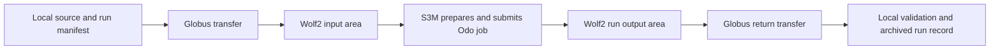

# Semi-production plan: scientific payload and data transfer

**Status:** proposed plan  
**Target for first implementation:** Odo through S3M  
**Goal:** run one small, scientifically meaningful analysis repeatedly with
declared inputs, validated outputs, and an auditable record of every run.

## Definition of semi-production

This is a controlled research workflow, not an unattended production service.
It must be reproducible, observable, and safe to rerun, while keeping a person
responsible for approving each live submission and data transfer. S3M itself is
an early-release API, so the workflow must continue to tolerate API changes and
must not be the only record of a result.

## Target design



Use separate immutable paths for each run:

```text
/gpfs/wolf2/olcf/stf053/proj-shared/ace-iri-concept/
  inputs/<dataset-id>/
  runs/<run-id>/
    manifest.json
    logs/
    outputs/
    result.json
```

`inputs/` contains immutable, checksum-verified data. `runs/` contains only
the data and outputs for one submission. Do not overwrite a completed run.

## Phase 0: make the scientific contract

Before adding application code, choose one analysis that completes in minutes
on one Odo node and write a short specification with:

- the scientific question and the expected output;
- input dataset source, license, classification, size, and checksum;
- application name, version, runtime environment, and command;
- expected files and a numerical or structural correctness check;
- expected resources and an upper runtime limit; and
- retention and sharing requirements for inputs and outputs.

**Exit criterion:** a colleague can review the input, command, and expected
result without reading the workflow implementation.

## Phase 1: establish the data-transfer lane

Use Globus for the first implementation. OLCF documents the **NCCS Open DTN
(Globus 5)** collection for Open user/project storage and the Wolf2 filesystem.
Use it to move data between a local or institutional collection and the Odo
project area. Do not transfer data through Odo login or compute nodes.

1. Create a small non-sensitive test dataset locally.
2. Transfer it to `inputs/<dataset-id>/` on Wolf2.
3. Compare a local SHA-256 manifest with checksums computed on Wolf2.
4. Verify owner, group, and permissions. Globus does not preserve file
   permissions, so set the required project permissions explicitly after the
   transfer.
5. Record the Globus task ID, source path, destination path, byte count, and
   checksums in the local run record.

Begin with manual Globus transfers. Add Globus CLI or SDK automation only after
the manual path is repeatable and the approved identity/credential approach is
known. No Globus credential belongs in Git.

**Exit criterion:** two independent transfers of the same small input produce
the same Wolf2 checksum manifest.

The first pilot transfer completed on 2026-09-22; see
[Globus transfer test: dataset 001](globus-transfer-test.md). Repeat it once
before treating the transfer lane as established.

## Phase 2: create the scientific run package

Extend `prepare` to create a local, ignored run directory containing:

- the reviewed S3M request JSON;
- a copy of the selected `.sbatch` source;
- an input manifest with relative paths, bytes, and SHA-256 checksums;
- an application configuration file; and
- a `run-manifest.json` with Git commit, Python version, configuration hash,
  planned Wolf2 paths, and timestamps.

The batch script should fail fast, check each declared input checksum, create
its own output and log directories, capture application version information,
and write `result.json`. It should use a nonzero exit code when the application
or validation fails.

**Exit criterion:** a prepared package can be inspected locally and explains
exactly what the Odo job will run.

## Phase 3: run and observe one analysis

Submit one reviewed run through S3M. Capture the returned Slurm job ID in the
local run record. Poll only the job-specific status endpoint until it reaches a
terminal state. Do not automatically resubmit a job when a network response is
lost; inspect Slurm status and the Wolf2 run directory first.

On completion, verify all of the following:

1. Slurm state is `COMPLETED` and exit status is zero.
2. `result.json` exists in the expected Wolf2 run directory.
3. Output checksums match the job-written manifest.
4. The scientific correctness check passes.

**Exit criterion:** the result is scientifically valid and can be traced to a
specific input manifest, code commit, application version, and job ID.

## Phase 4: retrieve and validate outputs

Use Globus to bring back the small result package: `result.json`, logs, output
manifest, and selected scientific outputs. Preserve the Odo-side data until the
local transfer and validation succeed. The local validation command must work
without contacting Odo and should verify expected files, checksums, and the
scientific acceptance rule.

**Exit criterion:** a second person can validate a retrieved package from its
manifest without rerunning the job.

## Phase 5: operational hardening

After several successful manual runs, add the following in order:

1. configuration schema validation and input-size limits;
2. explicit run states: prepared, transferred, submitted, completed, retrieved,
   and validated;
3. structured JSON event records with timestamps and job/Globus IDs;
4. a failure-recovery guide for transfer, scheduler, application, and validation
   failures; and
5. a small regression dataset and automated local tests.

Keep live submission and transfer approval manual until the failure paths are
well understood. Add parameter sweeps, larger datasets, GPU requests, or
automatic retries only after the single-analysis workflow remains reliable.

## Responsibilities and safeguards

| Area | Control |
| --- | --- |
| Credentials | Keep S3M and Globus credentials outside Git; use least-privilege, time-limited tokens. |
| Data | Confirm data classification and approved enclave before transfer. Start with non-sensitive data. |
| Cost and allocation | Use capped runtime and one-node requests until measured resource needs are known. |
| Reproducibility | Version scripts and configuration; hash inputs and outputs; retain manifests. |
| Recovery | Never overwrite a run or blindly retry a submission or transfer. |
| Retention | Keep raw inputs, transient outputs, and published results under an agreed retention policy. |

## Decisions needed before implementation

1. What is the first scientific analysis and its expected result?
2. What small input dataset may be moved to Odo's Open-enclave Wolf2 storage?
3. Which local or institutional Globus collection is the source and destination?
4. What application environment will Odo use: modules, container, or a built
   executable?
5. What validation criterion determines that a run is scientifically accepted?

## Sources

- [OLCF Data Storage and Transfers](https://docs.olcf.ornl.gov/data/index.html)
- [OLCF Data Transfer Nodes](https://docs.olcf.ornl.gov/systems/dtn_user_guide.html)
- [Odo user guide](https://docs.olcf.ornl.gov/systems/odo_user_guide.html)
- [OLCF S3M overview](https://docs.olcf.ornl.gov/services_and_applications/s3m/overview.html)
